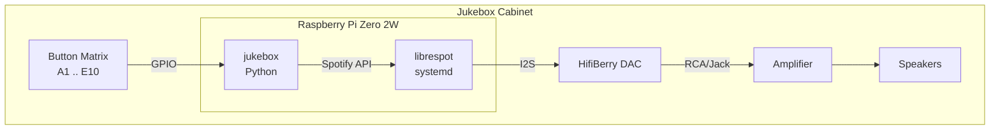
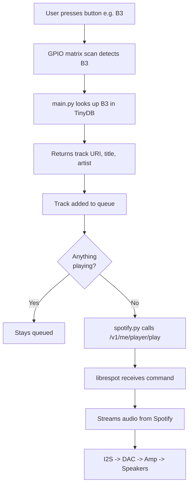
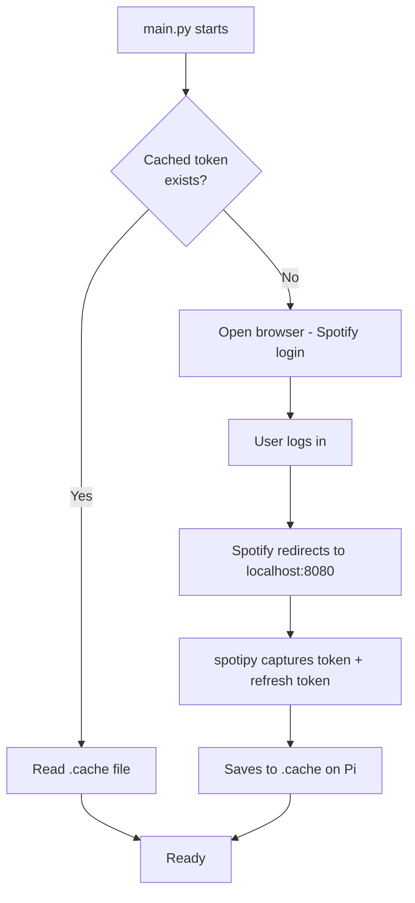
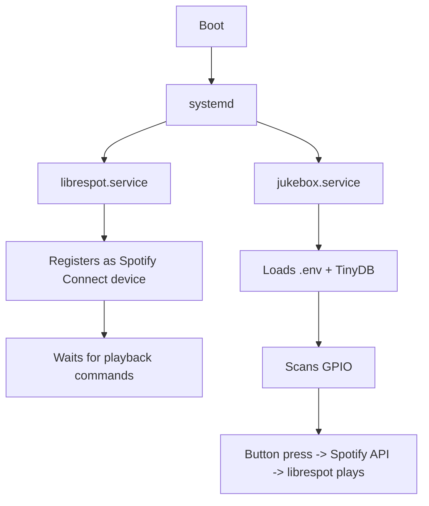

# JukeBox
This project is designed to work with Python 3.14, and a Raspberry Pi 2W.

## Design Plans
### 1. Overall System Architecture

### 2. Button Press to Audio

### 3. Auth Flow

### 4. Service Relationship
